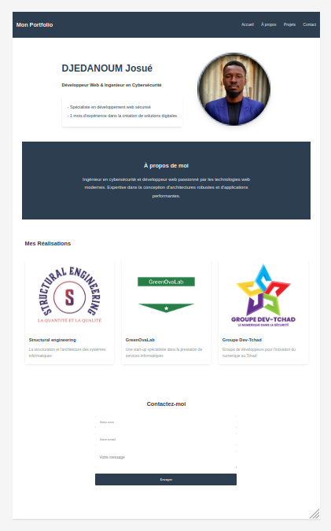

# Portfolio Professionnel

Portfolio personnel présentant mes compétences en développement web et cybersécurité. Ce site met en valeur mes projets réalisés et permet aux visiteurs de me contacter facilement.

## Fonctionnalités

- Présentation professionnelle avec photo
- Section "À propos" concise
- Galerie de projets responsive (3 projets)
- Formulaire de contact fonctionnel
- Design moderne et responsive 

## Technologies utilisées

- HTML5 sémantique
- CSS3 moderne (Flexbox, Grid)
- JavaScript vanilla
 
## captures d'écran

